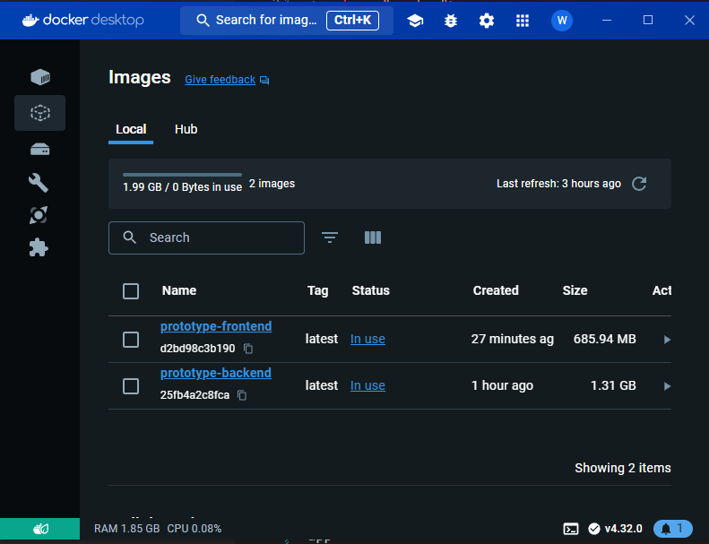
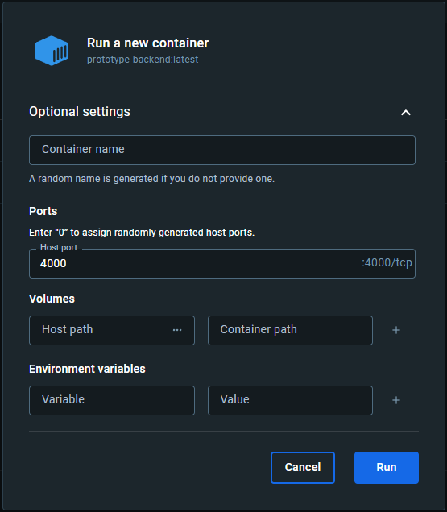

# Spacecrafted
<p align="center">

</p>
Revolutionizing Property Listings—Discover and Connect with Ideal Properties or Buyers, Enhanced by Virtual Staging to Transform Spaces and Visualize Potential


## How to run it
The project demonstrates a clean structure and a comprehensive containerization. To get the project up and running, follow the steps below:

1. Fire up your terminal and navigate to the project's root directory (where `docker-compose.yml` exists)
```shell
cd path/to/prototype/
```
2. Build the images for the Frontend and Backend modules using docker-compose
```shell
docker-compose build
```
3. Locate the created images in your Docker Desktop app under "Images"
<p align="center">

</p>

4. Run the Backend container **selecting port 4000 in the options**
<p align="center">

</p>

5. Run the Frontend container **selecting port 3000 in the options**
<p align="center">

</p>

6. Head to `http://localhost:3000/` in your browser to start the experience!